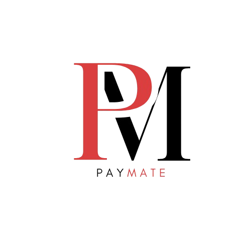

[](https://classroom.github.com/a/u5k3noT3)
<br>
<br>
<h1 align="center">🤑 PayMate 🤑</h1>


 
<p align = "center">


</p>
<br>
<p>Hello, we are PayMate!</p>
<p>At PayMate, our purpose is to empower individuals to take control of their finances with ease and confidence. We are dedicated to creating an intuitive personal finance management app that enables users to track income and expenses, manage budgets, and generate insightful financial reports. By providing powerful analysis tools, visualizations, and statistics, we help our users make informed financial decisions, guiding them towards a more secure and well-managed financial future.</p>
<br>

<h2 align="left">🚀🗂 Languages and Libraries </h2>
<p align="left">
<a href="https://www.cplusplus.com/"></a>
<a href="https://www.raylib.com/"></a>
</p>

<h2 align="left">🔧 Used Tools </h2>
<p align="left">
 <a href="https://visualstudio.microsoft.com/vs/"></a>
 <a href="https://teams.microsoft.com/_?culture=en-us&country=us#/conversations/19:b01cf915e57b430ea93ab780c4f6b6dc@thread.v2?ctx=chat"></a>
    <a href="https://git-scm.com/"></a>
   <a href="https://www.microsoft.com/en-ww/microsoft-365/word"></a>
   <a href="https://www.microsoft.com/en-us/microsoft-365/powerpoint">
   <a href="https://freelogopng.com/image/607"></a>
 <br>

<h2 align="left">📄📎 Documents</h2><br>
  <ul>
    <li><a href="https://codingburgas-my.sharepoint.com/:w:/g/personal/zvyankova22_codingburgas_bg/ESp9ud0WEEBBqB-2fQbLnA8BRI-jU82Xe0Z7zr6s1aBIgA?e=jwbu2L">Documentation</a></li>
    <li><a href="https://codingburgas-my.sharepoint.com/:p:/g/personal/zvyankova22_codingburgas_bg/EZqYdkRO07NFjPvcuTjo1I4B92fdZ2lkoUvLkiV39Iv__Q?e=hyJf0d">Presentation</a></li>
  </ul>  

<h2 align="left">👨🏻‍💻 Team Members </h2>
<table >
  <tr>
    <td align="center">Name</td>
    <td align="center">Role</td>
    <td align="center">Grade</td>
    <td align="center">Github</td>
  </tr>
  <tr>
    <td align="center"> Zhaklin Yankova</td>
    <td align="center">Scrum trainer</td>
    <td align="center">🟥 10B</td>
    <td align="center"> <a href="https://github.com/ZVYankova22">ZVYankova22 </a></td>
  </tr>
  <tr>
    <td align="center">Stiliyan Dimitrov</td>
    <td align="center">Backend developer</td>
    <td align="center">🟥 10B</td>
    <td align="center"> <a href="https://github.com/SKDimitrov22">SKDimitrov22 </a></td>
  </tr>
  <tr>
    <td align="center">Dimaya Noneva</td>
    <td align="center">Backend developer</td>
    <td align="center">🟥 10B</td>
    <td align="center"> <a href="https://github.com/DHNoneva22">DHNoneva22 </a></td>
  </tr>
    <tr>
    <td align="center">Stoyan Hristov</td>
    <td align="center">Backend developer</td>
    <td align="center">🟥 10B</td>
    <td align="center"> <a href="https://github.com/SPHristov22">SPHristov22 </a></td>
  </tr>
</table>
<br>

 <h2 align="left">🔒🔑 Access</h2>

 <p> Open cmd and clone our repo by typing</p>

```
git clone https://github.com/codingburgas/finance-challenge-paymate.git
```
<p>Thank you for scrolling this far! Show some 🤍 by starring the repo!</p>

